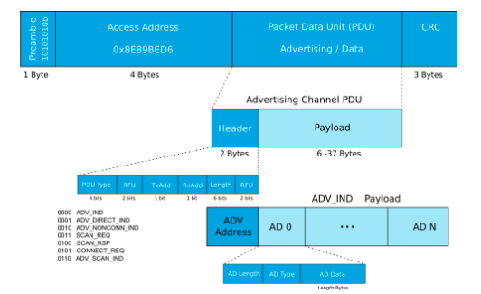
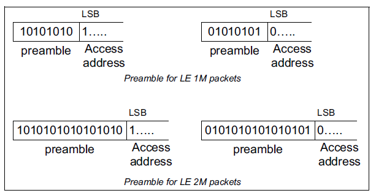
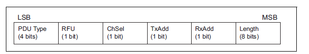
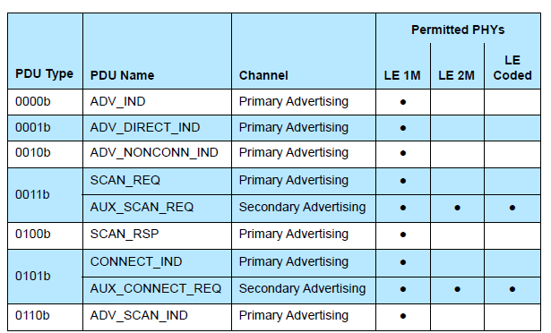

# EE290C Bluetooth Low Energy Baseband

This Documentation is for Bluetooth Low Energy (BLE) Baseband group work in EE290C @ UC Berkeley 2018 fall semester.

## Course Description
2018 Fall EE290C, taught by Prof. Borivoje Nikolic, offers Advanced Topics in Circuit Design: VLSI Signal Processing. The course adopts Chisel, an open-source hardware construction language developed at UC Berkeley, to implement digital signal processing designs. The design could be verified by hooked up to the Rocket Chip. Our group chose to implement a BLE baseband for the final project.
 

## Project Overview
The BLE baseband we implemented includes two main blocks: packet assmebler (PA) and disassmbler (PDA), which are responsible for TX and RX sides respectively. Two submodules, CRC and (de)whitening, are attached to PA/PDA to follow Bluetooth Specification v5.0. The final goal is to implement a complete BLE baseband loop chain. 

The diagram of the expected BLE loop chain is shown below:

 

## Team Members
Jerry Duan, Mingying Xie, and Yalun Zheng
  

## Tape-in 1
- Update PacketAssembler to new Chisel standard and connect to RocketChip
- Build PA Chain and insert FIFOs for testing
- Construct C tests to verify the functionality

## Tape-in 2
- Improve packet transmitting effeciency (delete CRC_seed and white_seed in the PA input bundle)
- Complete PA chain and the output matches software golden model
- Similar work as tape-in1 has been done to PacketDisAssembler (update PDA to Chisel standard)
- Complete PDA chain and the output matches software golden model

## Tape-out
- Verify the functionality of PA and PDA chain respectively by connecting to RocketChip and making comprehensive C tests
- Implement and verify the Loopback Chain
- Documentation
 

## Modules
1) PA: 
[packet assembler](https://github.com/ucberkeley-ee290c/fa18-ble/tree/master/doc/pa.md), 
[PA chain](https://github.com/ucberkeley-ee290c/fa18-ble/tree/master/doc/pa_chain.md)
2) PDA: 
[packet disassembler](https://github.com/ucberkeley-ee290c/fa18-ble/tree/master/doc/pda.md), 
[PDA chain](https://github.com/ucberkeley-ee290c/fa18-ble/tree/master/doc/pda_chain.md)
3) CRC: 
[CRC](https://github.com/ucberkeley-ee290c/fa18-ble/tree/master/doc/crc.md)
4) Whitening: 
[Whitening](https://github.com/ucberkeley-ee290c/fa18-ble/tree/master/doc/whitening.md)
5) Top level: 
[loopback](https://github.com/ucberkeley-ee290c/fa18-ble/tree/master/doc/loop.md)
 

## Working Principle
Below is an overall diagram of the BLE packet structure. As specified in Bluetooth Specification v5.0, the BLE packet includes Preamble, Access Address, PDU (header, advertising address and payload), and CRC.

### Preamble
For LE 1M packet, the preamble is determined by the last bit of access address (AA). It should be noted here, since the AA sequence has to be flipped for transmitting, the bit we actually look at is the first bit in the AA field (if 0, preamble is 01010101; if 1, preamble is 10101010).

### Access Address
The standard AA for broadcasting is 0x8E89BED6. Thus the encoded AA is 0110_1011_0111_1101_1001_0001_0111_0001.
Matlab code demonstration: ``fliplr(dec2bin(hex2dec('8E89BED6'),32))``

### Header
The PDU header contains 6 parts: PDU type, RFU, RxAdd, TxAdd, ChSel and Length.

#### PDU type
Our project adopts `ADV_NONCONN_IND` in LE 1M packet implementaion.

#### RFU
Reserved for future use in Spec v.05.
#### RxAdd, TxAdd
0 means public address, 1 means randomized address. Set both to 0 in this project. 
#### ChSel
Not used in this project.
#### Length
Indicate the size of payload in bytes/octets. The length should be larger than 6 (reserved for advertising address) and less than 37. For example, if we have 6 for address, 3 for headers, 6 for payload, then PDU_length is 15. Similar to AA, the transmition start with LSB, so length 15 is 11110000 to keep the correct order.

### CRC
For this part, please refer to [CRC](https://github.com/ucberkeley-ee290c/fa18-ble/tree/master/doc/crc.md).

## Tests
1. how to test
2. test results

## TODO
- Add-on features like FEC mentioned in Bluetooth 5 Spec

- Besides advertising PDU type, implement scan type (eg.`SCAN_REQ`), connect (`CONNECT_REQ`) and so on

- Apply more random-generated test cases

- Take operation frequency into considerations when the digital BLE baseband has to talk with analog circuits
 

## Acknowledgement
Here is our appreciation to Prof. Borivoje Nikolic, Prof. Kristofer Pister and the GSI Paul Rigge for guiding us in this project. Their valuable suggestions and feedback help us move forward. Also the work from last semester's group inspired us greatly and here is their tape-out (https://github.com/tapeout/ble-baseband). Lastly, we would like to thank David Burnett and Rachel Zoll for helping us get on board and explain the former BLE stucture and tests.

