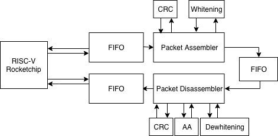
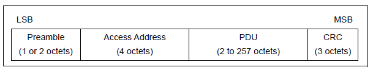

# EE290C Bluetooth Low Energy Baseband

This Documentation is for Bluetooth Low Energy (BLE) Baseband group work in EE290C @ UC Berkeley 2018 fall semester.

## Course Description
2018 Fall EE290C, taught by Prof. Borivoje Nikolic, offers Advanced Topics in Circuit Design: VLSI Signal Processing. The course adopts Chisel, an open-source hardware construction language developed at UC Berkeley, to implement digital signal processing designs. The design could be verified by hooked up to the Rocket Chip. Our group chose to implement a BLE baseband for the final project.
 

## Project Overview
The BLE baseband we implemented includes two parts: packet assmebler (PA) and disassmbler (PDA), which are responsible for TX and RX sides respectively. Two submodules, CRC and whitening, are attached to PA/PDA to follow Bluetooth Specification v5.0. The final goal is to implement a complete BLE baseband chain. 

The diagram of the expected BLE loop chain is shown below:

 

## Team Members
Jerry Duan, Mingying Xie, and Yalun Zheng
 

## Tape-in 1
- Update PacketAssembler to new Chisel standard and connect to RocketChip
- Build PA Chain and insert FIFOs for testing
- Construct C tests to verify the functionality
 

## Tape-in 2
- Improve packet transmitting effeciency (delete CRC_seed and white_seed in PA input bundle)
- Complete PA chain and the output matches software golden model
- Similar work as tape-in1 has been done to PacketDisAssembler (PDA chain, C tests)
 

## Modules
PA: 
[packet assembler](https://github.com/ucberkeley-ee290c/fa18-ble/blob/master/doc/pa.md), 
[PA chain](https://github.com/ucberkeley-ee290c/fa18-ble/blob/master/doc/pa_chain.md)
PDA: 
[packet disassembler](https://github.com/ucberkeley-ee290c/fa18-ble/blob/master/doc/pda.md), 
[PDA chain](https://github.com/ucberkeley-ee290c/fa18-ble/blob/master/doc/pda_chain.md)
Top level: 
[loopback](https://github.com/ucberkeley-ee290c/fa18-ble/blob/master/doc/loopback.md)
 

## Working Principle
### BLE packet structure

### I/O specification
TODO
### Parameter specification
TODO
 

## (to be modified to seperate .md)
1. &nbsp;&nbsp; In **assembler.scala**, the BLE baseband was updated to accommodate to new Chisel standard (wrap PA Block as lazyModule in PAChain). Another improvement is that, in the former implementation, each packet("PABundle") includes *trigger* (1 bit, denotes the beginning of a BLE packet), *data* (8 bits, the contents of BLE packets) *crc_seed* (24 bits), *white_seed* (7 bits), and *done* (1 bit, denotes the end of a BLE packet). Thus each time when transmitting, the effective payload takes up only 8 bits out of 41 and most parts are repetitive for a single BLE packet. We improved the Bundle structure to include only *trigger* and *data*. The transmission is achieved with a FSM which holds 6 stages: idle, preamble, access address, PDU_header, PDU_payload, CRC. Several modifications were done for proper state transitions.
2. &nbsp;&nbsp; In **PAChain.scala**, we basically integrated a complete chain for PacketAssembler testing. Two FIFOs were inserted on both input and output of the PacketAssembler. The PA bundle is transmitting by AXI4StreamNode. We made diplomatic TL node for regmap and used WriteQueue/ReadQueue to access the testing bundle.
The diagram of the PA chain is shown below:

3. &nbsp;&nbsp; In **pa.c**, we currently hard coded the testing case. The packet is generated by MATLAB code from David Burnett and there are detailed comments about how the packet is contructed. For now, our BLE baseband is transmitting *"SCUM3"*.
4. &nbsp;&nbsp; In **top.scala**, the PacketAssembler is connected to the RocketChip.
 

### TODO
- Loopback Chain

- Add-on features like FEC mentioned in Bluetooth 5 Spec.

- DMA implementation after C tests verifying the functionality
 

### Acknowledgement
Here is our appreciation to Prof. Borivoje Nikolic, Prof. Kristofer Pister and the GSI Paul Rigge for guiding us in this project. Their valuable suggestions and feedback help us move forward. Also the work from last semester's group inspired us greatly and here is their tape-out (https://github.com/tapeout/ble-baseband). Lastly, we would like to thank David Burnett and Rachel Zoll for helping us get on board and explain the former BLE stucture and tests.

