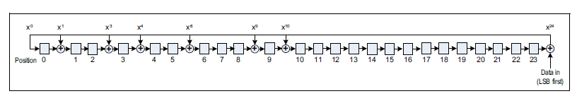

# CRC
The cyclic redundency check is used for error detection and error correction according to the 24-bit CRC sequence in a BLE packet. The CRC sequence is generated according to PDU when data is transmitted, and is checked by the packet disassembler. If the CRC sequence is correct, then the data is processed. Otherwise, the data is rejected.

According to Bluetooth Spec v.05, "for every Data Channel PDU, the shift register shall be preset with the CRC initialization value set for the Link Layer connection and communicated in the `CONNECT_IND` PDU. For the `AUX_SYNC_IND` PDU and its subordinate set, the shift register shall be preset with the CRCInit value set in the SyncInfo field (see Section 2.3.4.6) contained in the `AUX_ADV_IND` PDU that describes the periodic advertising. For all other Advertising Channel PDUs, the shift register shall be preset with 0x555555." The last case applies to this projct. The diagram below illustrates how the LFSR is initialized.

 
 
 ## Input and Output Ports
 ```
class Serial_CRC extends Module {
    val io      = IO(new Bundle {
      val operand  = Flipped(Decoupled(UInt(1.W)))
      val result   = Decoupled(UInt(24.W))
      val seed       = Input(UInt(24.W))
      val init       = Input(Bool())        
  })
}
 ```
A CRC module has three inputs and one output. `init` is a 1-bit input sent by the packet assembler as the signal of the beginning of the sequence. `seed` is a 24-bit input that CRC module needs to load to the corresponding registers. `operand` is a 1-bit input for bits to perform certain operations. `result` is a 24-bit output produced by CRC and taken by the packet assembler.  
