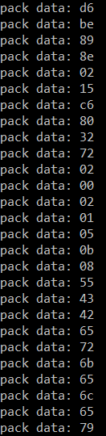
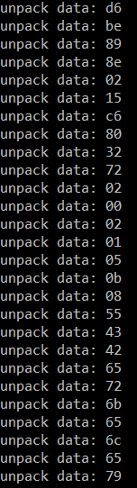

# Loop
 In order to fully verified the functionality of `PA_Chain` and `PDA_Chain`, we connected the output of `PA_Chain` with the input of `PDA_Chain`. The input of the `PA_Chain` and the output of the `PDA_Chain` should be the same. For future work, the loop can be broken, and be connected to other modules.
 
 ## Input and Output Ports
 Connection among stream nodes:
 ```
 readQueue.streamNode := packet_pda.streamNode := transitionQueue.streamNode := packet_pa.streamNode := writeQueue.streamNode
 ```
 `writeQueue` is the FIFO at the input side of the packet assembler. `readQueue` is the FIFO at the input side of the packet disassembler. `transitionQueue` is the FIFO between the packet assembler and the packet disassembler. This FIFO collects outputs from the packet assembler, and sends the data to the packet disassembler. 

## Tests
To do the C-based top level test for Packet Assembler Chain:
* Build the project: first enter folder `fa18-ble/verisim` and change line 5 of ``Makefile`` to 
```
PROJECT ?= Loop
```
* Then go to folder `fa18-ble/tests` and change line 6 of ``Makefile`` to 
```
PROGRAMS = loop
```
* Then type `make` in the tests folder to generate the .riscv file corresponding to the C code.
* Go back to folder `fa18-ble/verisim` and type `make debug` to apply the TestHarness and create the executable for the C tester file.
* The last step is to type 
```
./simulator-freechips.rocketchip.system-DefaultConfig-debug ../tests/loop.riscv
```
to run the project on the RocketChip.
* You can also generate a waveform for debugging by typing 
```
./simulator-freechips.rocketchip.system-DefaultConfig-debug -vout.vcd ../tests/loop.riscv
```

### Results
This test takes string "UCBerkeley" as the payload data. You could observe that the last ten "pack data" is 0x55, 0x43, 0x42, 0x65, 0x72, 0x6b, 0x65, 0x6c, 0x65, 0x79, which are the ASCII representation of "U", "C", "B", "e", "r", "k", "e", "l", "e", "y" respectively. The expected successful results should be that the unpack data at the end of the loop chain exactly matches the pack data at the beginning of the loop chain.



