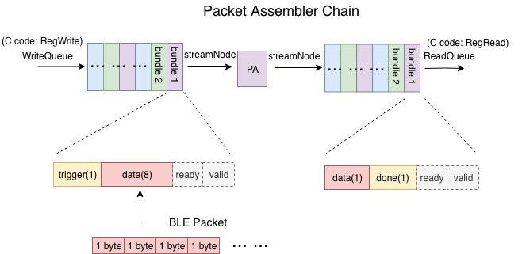
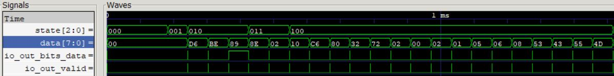

# PA_Chain
 In **PAChain.scala**, we basically integrated a complete chain for PacketAssembler testing. PA_Chain connects a packet assembler to Rocketchip. By using C code, BLE packet is writen into an asynchronous FIFO bundle by bundle. The PA bundle is transmitting by AXI4StreamNode. We made diplomatic TL node for regmap and used WriteQueue/ReadQueue to access the testing bundle. Then, the FIFO is connected to the packet assembler, and the other side of the packet assembler is connected to another asynchronous FIFO, which serves as a purpose of checking the result. The diagram of PA chain is illustrated below:
 
 
 
 ## Input and Output Ports
Connection among stream nodes:
```
readQueue.streamNode := packet.streamNode := writeQueue.streamNode
```
* `writeQueue` is the FIFO at the input side of the packet assembler. `readQueue` is the FIFO at the output side of the packet assembler. 

## Tests
To do the C-based top level test for Packet Assembler Chain:
* Build the project: first enter folder `fa18-ble/verisim` and change line 5 of ``Makefile`` to 
```
PROJECT ?= PacketAssembler
```
* Then go to folder `fa18-ble/tests` and change line 6 of ``Makefile`` to 
```
PROGRAMS = pa
```
* Then type `make` in the tests folder to generate the .riscv file corresponding to the C code.

* Go back to folder `fa18-ble/verisim` and type `make debug` to apply the TestHarness and create the executable for the C tester file.
* The last step is to type 
```
./simulator-freechips.rocketchip.system-DefaultConfig-debug ../tests/pa.riscv
```
to run the project on the RocketChip.
* You can also generate a waveform for debugging by typing 
```
./simulator-freechips.rocketchip.system-DefaultConfig-debug -vout.vcd ../tests/pa.riscv
```
Below is a sample waveform. 



### Results
This test takes string "290C" as the payload data. You could observe that the last four "pack data" is 0x32, 0x39, 0x30, 0x43, which are the ASCII representation of "2", "9", "0", "C" respectively.


