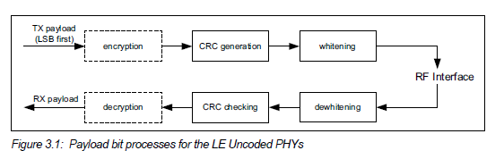

# Whitening
A whitening module is used to prevent long sequences of zeros or ones. It is performed similar to a CRC despite some subtle difference. According to the Bluetooth spec, whitening is applied to PDU and CRC fields and is performed after CRC in the packet assembler, and dewhitening is applied similarly before CRC in the packet disassembler.


Whitening and de-whitening is achieved using a 7-bit Linear Feedback Shift Register (LFSR). The shift register is initialized in the following manner:
* Position 0 is set to 1
* Positions 1 to 6 is set to the channel index of the transmitting/receiving channel, with the most significant bit set to position 1 and the least significant bit set to position 6. In our case, the channel index is 0x25, so the shift register is initialized to 1100101.
 
 ## Input and Output Ports
 ```
 class Whitening extends Module {
    val io = IO(new Bundle {
        val operand  = Flipped(DecoupledIO(UInt(1.W)))
        val result   = Decoupled(UInt(1.W))
        val seed     = Input(UInt(7.W))
        val init     = Input(Bool())       
  })
}
 ```
 Like a CRC module, a whitening has three inputs and one output. `init` is a 1-bit input sent by the packet assembler as the signal of the beginning of the sequence. `seed` is a 7-bit input that CRC module needs to load to the corresponding registers. `operand` is a 1-bit input for bits to perform certain operations. `result` is a 1-bit output produced by whitening and taken by the packet assembler. 
